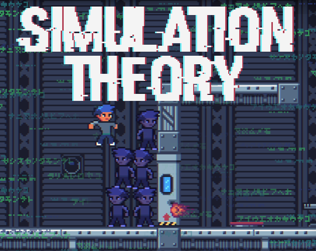

# Simulation Theory - A GitHub GameOff 2021 Game Jam Game

## About

Simulation Theory is a game by NimbleBeasts for Github's GameOff 2021 Game Jam. Our interpretation of the theme 'bug' is that the level is not completely cleared due to a bug and you meet your old records again in the form of ghosts.

## Play!

Play it in the browser or get a build for your pc here https://nimblebeastscollective.itch.io/simulation-theory.

## Controls

| Action   | Keys        | Alt. Keys |
| -------- | ----------- | --------- |
| Movement | Cursor keys | WASD      |
| Jump     | X/V         | Space     |
| Shoot    | Z/C         | Y         |
| Restart  | R           | -         |

## Godot

This game was made using Godot 3.4

## Credits

Font: "Pixel UniCode" by ivancr72

Music: Ozzed https://ozzed.net/

For complete license information please have a look at the LICENSE file.
