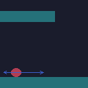
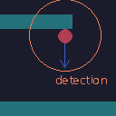
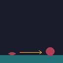

# Enemy Types

| Working-Title | walking | destroyed by jump | destroyed by shot | misc                                              |
| ------------- | ------- | ----------------- | ----------------- | ------------------------------------------------- |
| Normal guy    | x       | x                 | x                 | -                                                 |
| Fall guy      | -       | -                 | x                 | stucked until detection, falling down             |
| Bounce guy    | x       | -                 | x                 | stepping on this guy will push the player upwards |
| Shooting guy  | -       | x                 | -                 | shooting periodically                             |

## Normal Guy

Just the normal type of enemy. Can harm the player by collision. Can be destroyed by jump and slap.

## Fall Guy

Static enemy until the player or ghost enters detection range. Then falls from ceiling. Dealing damage on collision.
Could be slapped.

## Bounce Guy

Touching this one will result in pushing the player upwards - maybe in spikes ;)

## Shooting Guy

This guy is shooting a projectile on a specific frequency.

# Required sounds

- [ ] Button Click
- [x] Beam sound
- [x] Jump / Landing?
- [x] Shoot Player
- [x] Checkpoint reached
- [x] portal idle / close
- [x] Hit sound
- [ ] Hit Enemy sound
- [x] Shoot ShootGuy
- [ ] Pop Bounceguy
- [ ] Fallguy
- [ ] Player Hurt
- [ ] Dialogue Popup
- [x] Dialogue letter
- [ ] door open / close
- [x] COIN
- [x] ammo

# Music

Super Secret Tune - Lesser than three (menu?)
Dont be a bitch remix
delicious keys

Highway Slaughter - Cor Metallicum

# TODO:

- [ ] complete sounds
- [x] Level 1 - ez respawn
- [ ] Level 2

---

- [x] Portraits
- [ ] Level 3
- [ ] Level 4

---

- [ ] Level 5
- [ ] Hud rework
- [ ] Notification Popup (ammo, memory pickup; instructions; hints)

---

- [ ] add translations
- [ ] remove french
- [ ] Title Design
- [ ] Itch Page

# Dialogues

Max-size: Professor: a a a a a a a a a a a a a a a a a a a a a a a a a a a a a a a a a a a a a a a a a a a a a a a a a a a a a a a a a a a a a a a a a a a a a a a a a a a a a a a a

(170 chars - name) for safety reason max 150 chars:
Professor: a a a a a a a a a a a a a a a a a a a a a a a a a a a a a a a a a a a a a a a a a a a a a a a a a a a a a a a a a a a a a a a a a a a a a a

Tutorial Level:

(Trigger: in spawner)
PROFESSOR: YES! Finally it worked... Subject_3 can you understand me?
SUBJECT_3: Uhh.. y-yes. Where am I? Who am I?
PROFESSOR: You are a.. um.. Artificial Intelligence in a simulation. My simulation.
SUBJECT_3: I guess... Ok?
PROFESSOR: Let's see if your motor skills work. Move with the cursor keys or WASD.

(Trigger: before wall)
PROFESSOR: You can jump by using X/V/Space.
SUBJECT_3: Ok, I already expected something like this.

(Trigger: in pit)
PROFESSOR: Damn, it seems like you're stucked. Try pressing R to restart.
SUBJECT_3: Ok.

(Trigger: in spawner)
PROFESSOR: Wait.. what? Why are there two of you now? This must be a BUG!
PROFESSOR: Subject_3, try to use your former self to cross the gap!
SUBJECT_3: Subje.. My name is .. M-Marc!
PROFESSOR: (shook) Oh boy, his consciousness... returns!
MARC: I know that voice! What have you done to me?!
PROFESSOR: ...

(Trigger: memory chunk)
MARC: Crazy Professor is his real name.
MARC: Looks like collecting this RAM bites are helping me remember.
MARC: He must be keeping my consciousness trapped in this simulation.

Level 1:
(Trigger: beginning)
PROFESSOR: So you've made it out of the first stage. Good.
PROFESSOR: I've looked into the code, the bug must have been...
MARC: You are the Crazy Professor, I can remember now.
CRAZY PROFESSOR: All right, now what?
CRAZY PROFESSOR: You will never get out of here. HAHAHAHA
MARC: ...

(Trigger: before double door)
MARC: hm, looks like the bug has not been fixed.
MARC: I should really make use of my ghosts.
